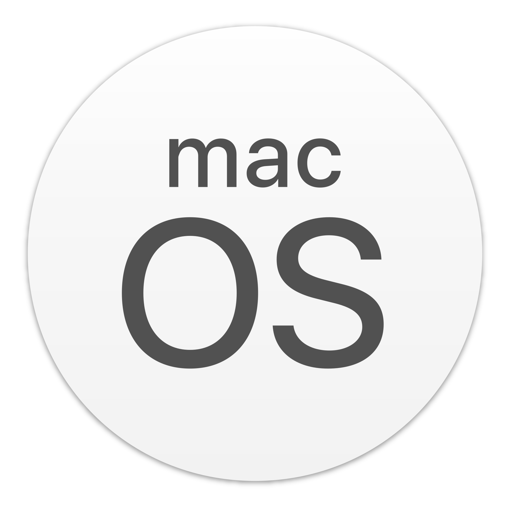
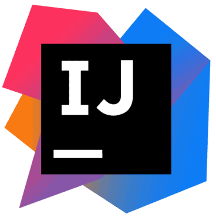
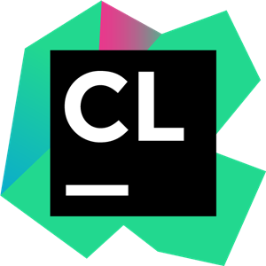
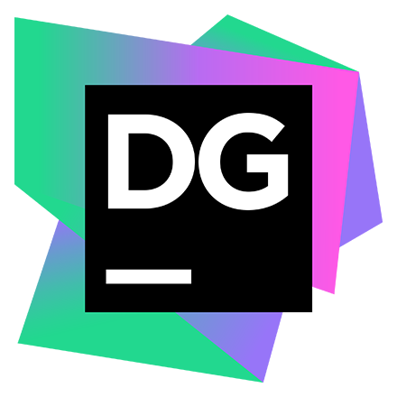

## Languages

## [🇫🇷](README.md) [🇺🇸](README.en.md)

---

## 👋 Hi there, I'm Romain Frezier !

📚 I am in 5th (and last) year of engineering school in Computer Science and Management, at [Polytech Montpellier](https://www.polytech.umontpellier.fr/images/ecole/Plaquettes/SPECIALITE_IG_2018_EN.pdf), France. Expected graduation: September 2024.

🏔 Originally from Haute-Savoie in France, I am passionate about sports and more particularly mountain sports such as hiking, ski touring, trail running...

📷 During my outings in the mountains, I love to photograph the landscapes! You can find some of my pictures [here](https://www.instagram.com/mountainpeaktures/).

🎯 I'm currently looking for a **6-month end-of-study internship** between March 1 and August 31, 2024. I'm mainly looking in the Lake Geneva area, in order to get closer to the mountains I love so much.

---

### Contact me ↘️

---

### Languages, Technologies et Softwares 

<h4 style="border-bottom: blue solid 1px">• Programming Languages</h4>

 

<h4 style="border-bottom: white solid 1px">• Web programming & technologies</h4>

<a href="https://developer.mozilla.org/en-US/docs/Web/HTML" target="blank" style="text-decoration: none">
    <picture>
        <source media="(prefers-color-scheme: dark)" srcset="img/html-logo-light.png">
        
    </picture>
</a>

<a href="https://developer.mozilla.org/en-US/docs/Web/CSS" target="blank" style="text-decoration: none">
    <picture>
        <source media="(prefers-color-scheme: dark)" srcset="img/css-logo-light.png">
        
    </picture>
</a>

 

<h4 style="border-bottom: white solid 1px">• Data bases</h4>

<a href="https://www.mongodb.com" target="blank" style="text-decoration: none">
    <picture>
        <source media="(prefers-color-scheme: dark)" srcset="img/mongo-db-logo-light.png">
        
    </picture>
</a>

 

<h4 style="border-bottom: red solid 1px">• Softwares & tools</h4>

<a href="https://github.com/" target="blank" style="text-decoration: none">
    <picture>
        <source media="(prefers-color-scheme: dark)" srcset="img/github-logo-light.png">
        
    </picture>
</a>

 

---

### 📈 Some stats :
 

### 🖥 Most used languages :
 

---

## My pinned repositories

---

© Romain Frezier - 2023
