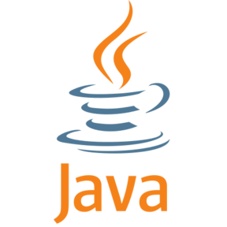
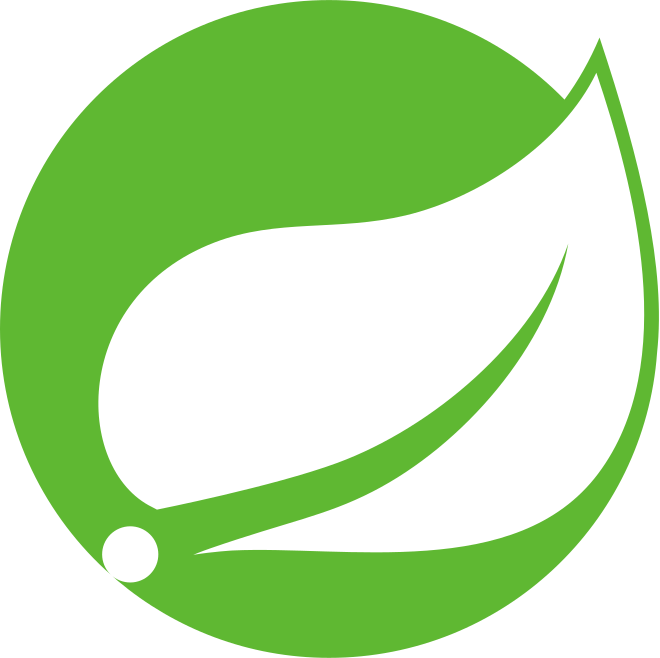
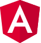
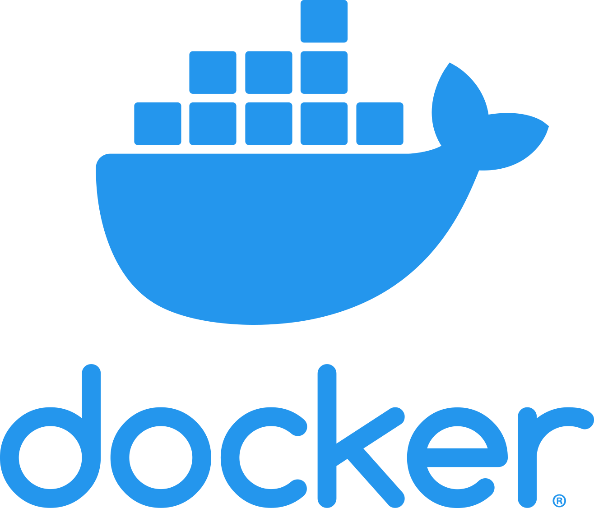
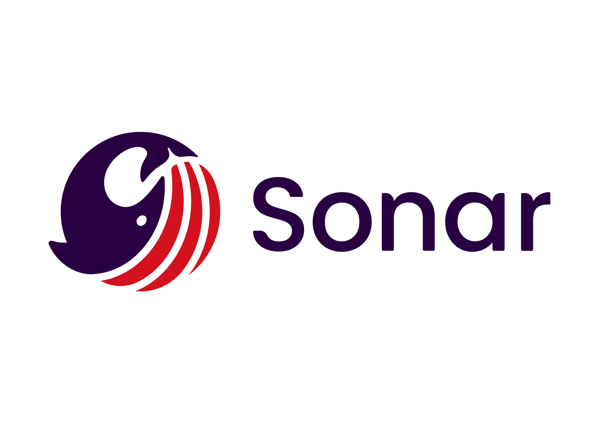
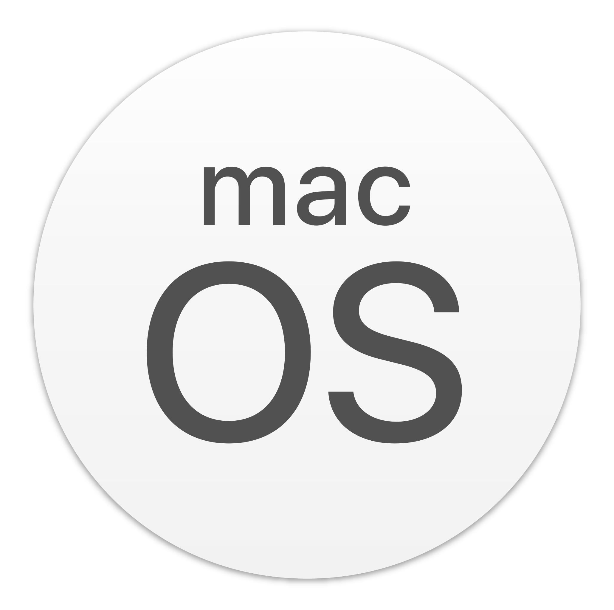
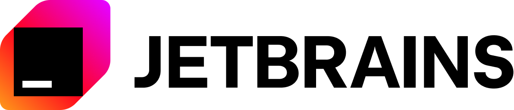

## Languages

---

## 👋 Hello everyone, I'm Romain Frezier!

🚀 I'm 24 years old and a Computer Science and Management engineer, graduated from [Polytech Montpellier](https://www.polytech.umontpellier.fr/), France.

 I currently work at <a href="https://www.infomaniak.com/en">Infomaniak | The Ethical Cloud</a>, in Geneva, as a Developer Team Leader in the Events & Marketing team, where I manage a team of 12 developers.

💻 As a fullstack developer, I enjoy building clean, maintainable, and useful applications, with a strong focus on backend, code quality, and eco-design.

🏔 Originally from Haute-Savoie, I'm passionate about sports, nature, and especially mountain sports: hiking, ski touring, trail running...

📷 During my mountain trips, I love taking landscape photos!

🌐 You can also check out my portfolio here: [romainfrezier.com](https://romainfrezier.com)

---

### ↘️ Contact me

---

### 🔗 Useful links

- [⚙️ Languages, technologies and software](#️-languages-technologies-and-software)
- [🚀 Portfolio](#-portfolio)
- [📈 Some stats](#-some-stats)
- [📌 My pinned repositories](#-my-pinned-repositories)
- [📁 Other repositories](https://github.com/romainfrezier?tab=repositories)

---

### ⚙️ Languages, technologies and software

 

 

 

 

---

### 🚀 Portfolio

My portfolio showcases my skills, my background, and allows direct contact. It also supports French/English internationalization, multiple themes, Jest testing, SonarQube analysis, and deployment via GitHub Actions on an Infomaniak VPS.

---

### 📈 Some stats

 

### 🖥 Most used languages

 

---

### 📌 My pinned repositories

---

© Romain Frezier - 2026