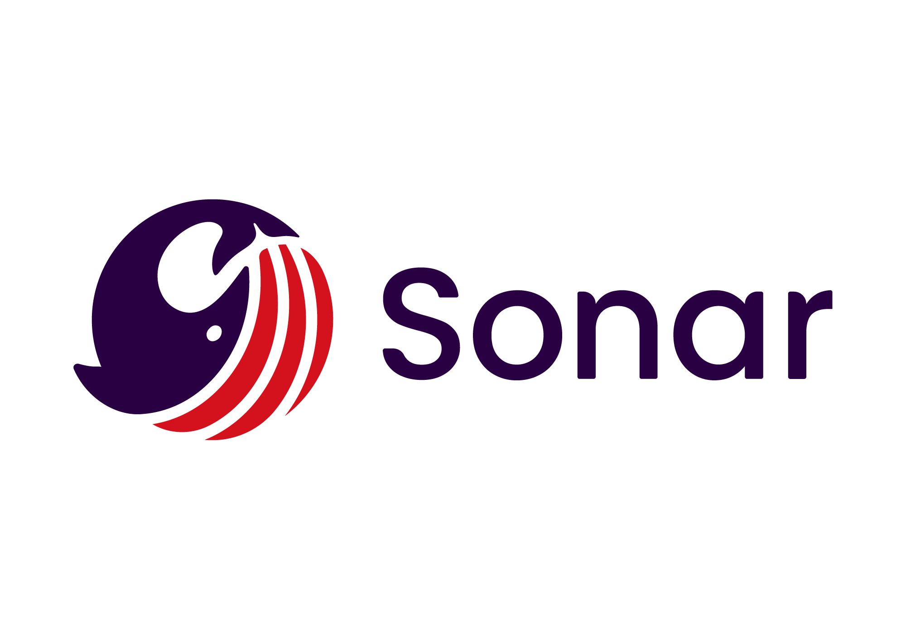
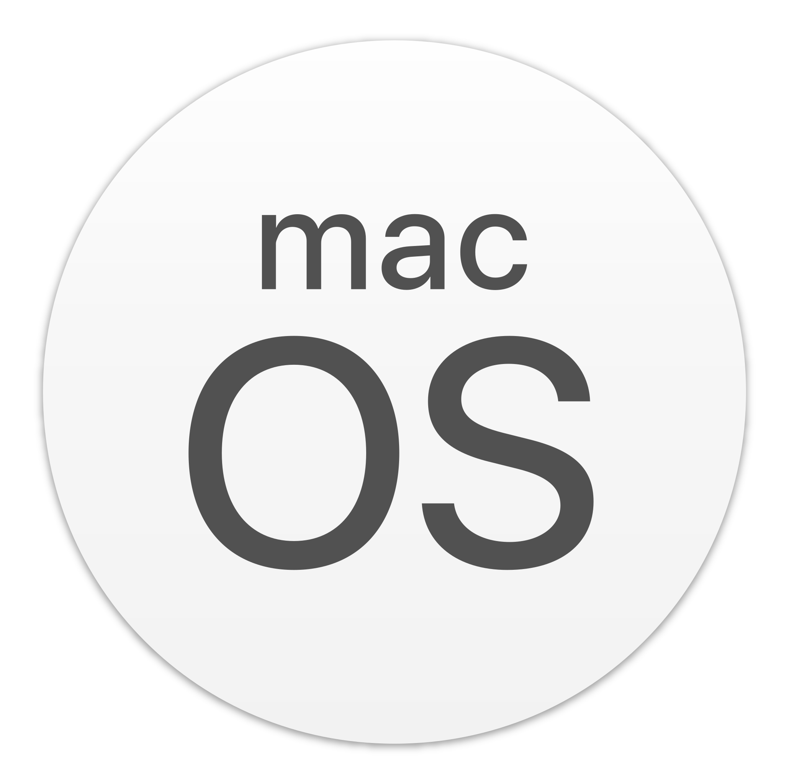

  <a href="README.md">🇫🇷 Français</a> · <a href="README.en.md">🇬🇧 English</a>

  
  <h1>Romain Frezier</h1>
  
<strong>Developer Team Leader · Full-stack engineer · Geneva</strong>

  
I turn ideas into web products that are simple, reliable and enjoyable to use.

  

    <a href="https://romainfrezier.com">Personal website</a> ·
    <a href="https://www.linkedin.com/in/romainfrezier/">LinkedIn</a> ·
    <a href="mailto:romainfrezier@gmail.com">Email</a> ·
    <a href="https://www.instagram.com/romainfrz/">Instagram</a>
  

---

## About

- 💼 Developer Team Leader at [Infomaniak | The Ethical Cloud](https://www.infomaniak.com/en), in Geneva. I lead a team of 12 developers in the Events & Marketing team.
- 🎓 Engineer in Computer Science and Management, graduated from [Polytech Montpellier](https://www.polytech.umontpellier.fr/).
- 💻 I enjoy building clean and maintainable applications, with a strong focus on backend, code quality and eco-design.
- 🏔 Originally from Haute-Savoie, I recharge by hiking, ski touring and trail running.
- 📷 I photograph mountain landscapes on [@mountainpeaktures](https://www.instagram.com/mountainpeaktures/).

## Stack

<table>
  <tr>
    <th align="left">Languages</th>
    <th align="left">Web & frameworks</th>
    <th align="left">Data</th>
    <th align="left">DevOps & tools</th>
  </tr>
  <tr>
    <td valign="top">
      
      
      
       PHP · Java · Python · TypeScript
    </td>
    <td valign="top">
      
      
      
      
       Laravel · Spring Boot · Angular · React
    </td>
    <td valign="top">
      
      
      
       PostgreSQL · MariaDB · MongoDB
    </td>
    <td valign="top">
      
      
      
       Docker · GitHub Actions · SonarQube
    </td>
  </tr>
  <tr>
    <td colspan="4" align="center">
      
      
      
       Infomaniak · macOS · JetBrains
    </td>
  </tr>
</table>

## Portfolio

My portfolio showcases my background, skills and projects. It supports English and French, multiple themes, Jest tests, SonarQube analysis and deployment through GitHub Actions on an Infomaniak VPS.

  

  <a href="https://romainfrezier.com">Discover the portfolio →</a>

## Public projects

<table>
  <tr>
    <td width="50%" valign="top">
      <a href="https://github.com/romainfrezier/key-recorder"><strong>key-recorder</strong></a> 
      An open-source macOS app to track and analyse keyboard usage. 
      Swift · macOS · open source
    </td>
    <td width="50%" valign="top">
      <a href="https://github.com/romainfrezier/Portfolio"><strong>Portfolio</strong></a> 
      My personal portfolio and front-end experiments. 
      TypeScript · web
    </td>
  </tr>
  <tr>
    <td width="50%" valign="top">
      <a href="https://github.com/romainfrezier/Seasonsforce"><strong>Seasonsforce</strong></a> 
      A school project exploring microservices and a mobile application. 
      Spring · React Native · microservices
    </td>
    <td width="50%" valign="top">
      <a href="https://github.com/romainfrezier/Projet-FAR"><strong>Projet-FAR</strong></a> 
      A messaging system running on a local network. 
      C · networking · school project
    </td>
  </tr>
</table>

  <a href="https://github.com/romainfrezier?tab=repositories">Browse all repositories →</a>

---

  © 2026 Romain Frezier · Built between the Alps and the cloud.

