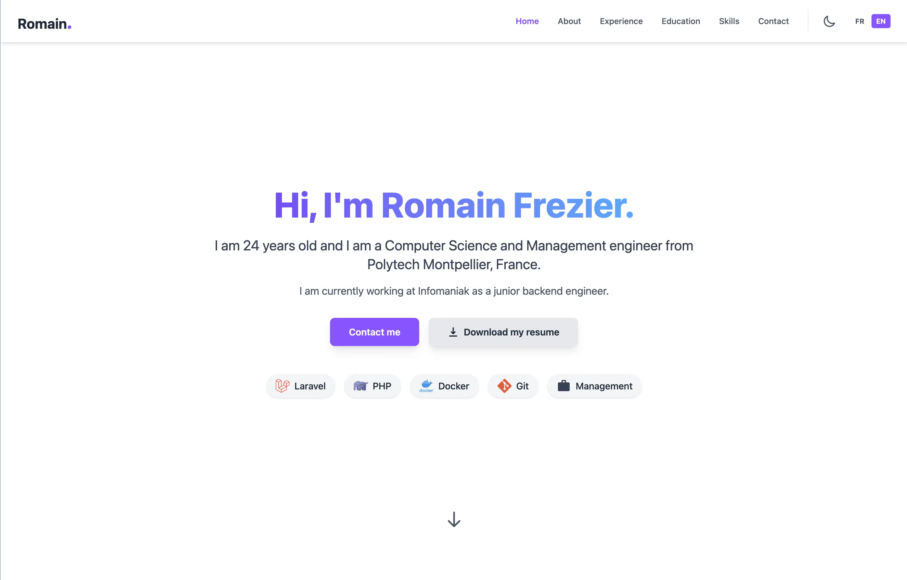

## Langues

---

## 👋 Bonjour à tous, je suis Romain Frezier !

🚀 J’ai 24 ans et je suis ingénieur en Informatique et Gestion, diplômé de [Polytech Montpellier](https://www.polytech.umontpellier.fr/), France.

 Je travaille actuellement chez <a href="https://www.infomaniak.com/fr">Infomaniak | The Ethical Cloud</a>, à Genève, en tant que Developer Team Leader dans l'équipe Events & Marketing dans laquelle je gère une équipe de 12 développeurs.

💻 Développeur fullstack, j’aime construire des applications propres, maintenables et utiles, avec une attention particulière pour le backend, la qualité de code et l’éco-conception.

🏔 Originaire de Haute-Savoie, je suis passionné de sport, de nature et plus particulièrement de sports de montagne : randonnée, ski de randonnée, trail...

📷 Pendant mes sorties en montagne, j’adore photographier les paysages !

🌐 Vous pouvez aussi découvrir mon portfolio ici : [romainfrezier.com](https://romainfrezier.com)

---

### ↘️ Me contacter

---

### 🔗 Liens utiles

- [⚙️ Langages, technologies et logiciels](#️-langages-technologies-et-logiciels)
- [🚀 Portfolio](#-portfolio)
- [📈 Quelques stats](#-quelques-stats)
- [📌 Mes dépôts épinglés](#-mes-dépôts-épinglés)
- [📁 Autres dépôts](https://github.com/romainfrezier?tab=repositories)

---

### ⚙️ Langages, technologies et logiciels

 

 

 

 

---

### 🚀 Portfolio

Mon portfolio présente mes compétences, mon parcours et permet de me contacter directement. Il supporte aussi l’internationalisation français/anglais, plusieurs thèmes, des tests avec Jest, une analyse SonarQube et un déploiement via GitHub Actions sur VPS Infomaniak.

  

---

### 📈 Quelques stats

 

### 🖥 Les langages les plus utilisés

 

---

### 📌 Mes dépôts épinglés

---

© Romain Frezier - 2026