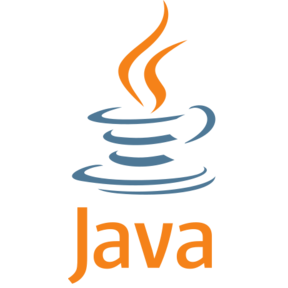
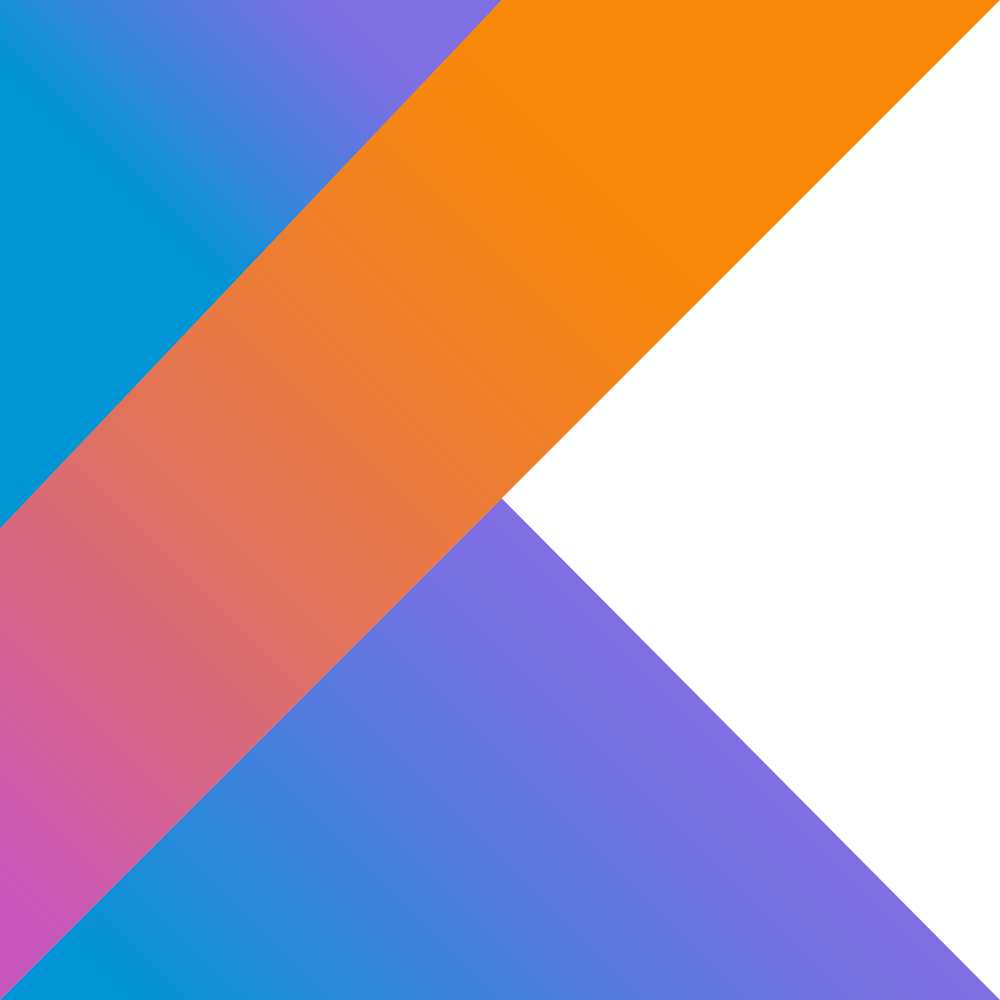
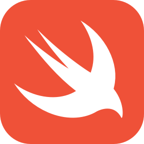
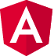
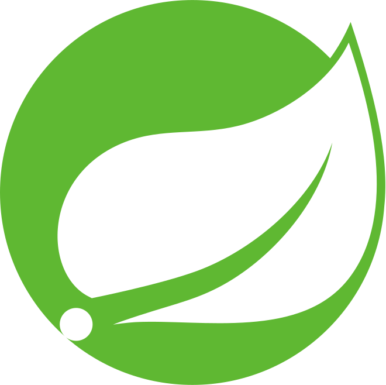
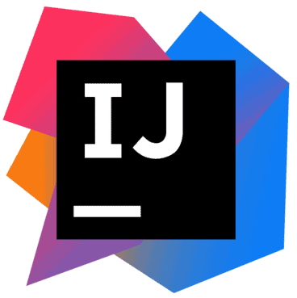
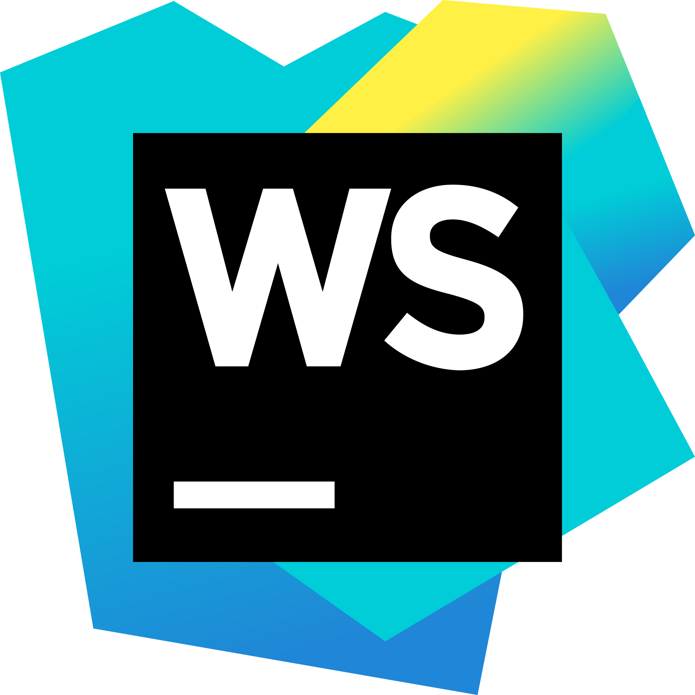
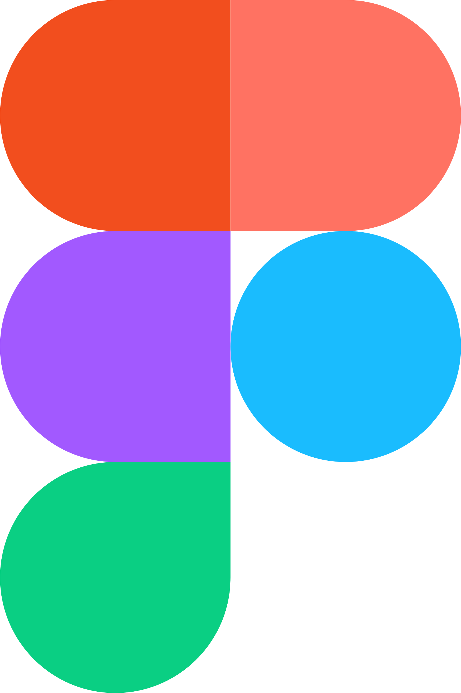

  <a href="README.md">🇫🇷 Français</a> · <a href="README.en.md">🇬🇧 English</a>

  
  <h1>Romain Frezier</h1>
  
<strong>Dev Team Leader · Full-stack engineer · Genève</strong>

  
Je transforme des idées en produits web simples, solides et agréables à utiliser.

  

    <a href="https://romainfrezier.com">Site personnel</a> ·
    <a href="https://www.linkedin.com/in/romainfrezier/">LinkedIn</a> ·
    <a href="mailto:romainfrezier@gmail.com">Email</a> ·
    <a href="https://www.instagram.com/romainfrz/">Instagram</a>
  

---

## À propos

- 💼 Dev Team Leader chez [Infomaniak | The Ethical Cloud](https://www.infomaniak.com/fr), à Genève.
- 🎓 Ingénieur en Informatique et Gestion, diplômé de [Polytech Montpellier](https://www.polytech.umontpellier.fr/).
- 🏔 Originaire de Haute-Savoie, je recharge les batteries en randonnée, ski de randonnée et trail.
- 📷 Je photographie les paysages de montagne sur [@mountainpeaktures](https://www.instagram.com/mountainpeaktures/).

## Stack

<table>
  <tr>
    <th align="left">Langages</th>
    <th align="left">Web & back-end</th>
    <th align="left">Data & infrastructure</th>
    <th align="left">Outils</th>
  </tr>
  <tr>
    <td valign="top">
      
      
      
      
      
       Java · Kotlin · Python · Swift · C
    </td>
    <td valign="top">
      <a href="https://www.typescriptlang.org/"><strong>TypeScript</strong></a> ·
      
      
      
      
       TypeScript · Angular · React · Laravel · Spring Boot
    </td>
    <td valign="top">
      
      <a href="https://www.mongodb.com/"><picture><source media="(prefers-color-scheme: dark)" srcset="img/mongo-db-logo-light.png" /></picture></a>
      
      
       PostgreSQL · MongoDB · MySQL · Docker
    </td>
    <td valign="top">
      <a href="https://github.com/"><picture><source media="(prefers-color-scheme: dark)" srcset="img/github-logo-light.png" /></picture></a>
      
      
      
       GitHub · IntelliJ IDEA · WebStorm · Figma
    </td>
  </tr>
</table>

## Projets publics

<table>
  <tr>
    <td width="50%" valign="top">
      <a href="https://github.com/romainfrezier/key-recorder"><strong>key-recorder</strong></a> 
      Application macOS open source pour suivre et analyser son usage du clavier. 
      Swift · macOS · open source
    </td>
    <td width="50%" valign="top">
      <a href="https://github.com/romainfrezier/Portfolio"><strong>Portfolio</strong></a> 
      Mon portfolio personnel et mes expérimentations front-end. 
      TypeScript · web
    </td>
  </tr>
  <tr>
    <td width="50%" valign="top">
      <a href="https://github.com/romainfrezier/Seasonsforce"><strong>Seasonsforce</strong></a> 
      Projet d’école autour d’une architecture microservices et d’une application mobile. 
      Spring · React Native · microservices
    </td>
    <td width="50%" valign="top">
      <a href="https://github.com/romainfrezier/Projet-FAR"><strong>Projet-FAR</strong></a> 
      Système de messagerie fonctionnant sur un réseau local. 
      C · réseau · projet d’école
    </td>
  </tr>
</table>

  <a href="https://github.com/romainfrezier?tab=repositories">Voir tous mes dépôts →</a>

---

  © 2026 Romain Frezier · Construit entre les Alpes et le cloud.

