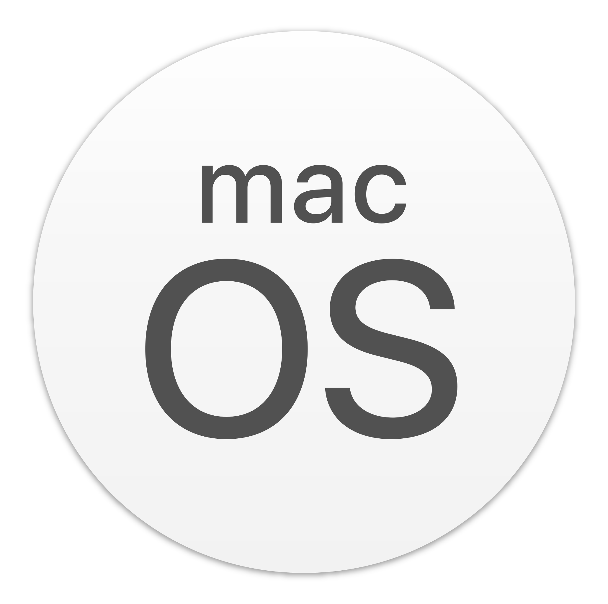

## Langues

---

## 👋 Bonjour a tous, je suis Romain Frezier

📚 Je suis en 5ᵉ (et dernière) année d'école d'ingénieur en Informatique et Gestion, à [Polytech Montpellier](https://www.polytech.umontpellier.fr/images/ecole/Plaquettes/SPECIALITE_IG_2019HD.pdf), France. Date prévue d'obtention du diplôme : Septembre 2024.

🏔 Originaire de Haute-Savoie, je suis passionné de sport et plus particulièrement de sport de montagne comme la randonnée, le ski de randonnée, le trail...

📷 Pendant mes sorties en montagne, j'adore photographier les paysages ! Vous pouvez retrouver certaines de mes photos [ici](https://www.instagram.com/mountainpeaktures/).

---

### ↘️ Me contacter

---

### 🔗 Liens utiles

- [Lanagages, Technologies et Logiciels](#-langages-technologies-et-logiciels)
- [Quelques stats](#-quelques-stats)
- [Mes dépots épingles](#-mes-dépots-épingles)
- [Autres dépots](https://github.com/romainfrezier?tab=repositories)

---

### ⚙️ Langages, Technologies et Logiciels

 

<a href="https://sass-lang.com/" target="blank" style="text-decoration: none; display: flex;">
    <picture style="margin: auto">
        <source media="(prefers-color-scheme: dark)" srcset="img/scss-logo.png">
        
    </picture>
</a>

 

<a href="https://www.mongodb.com" target="blank" style="text-decoration: none">
    <picture>
        <source media="(prefers-color-scheme: dark)" srcset="img/mongo-db-logo-light.png">
        
    </picture>
</a>

 

<a href="https://aws.amazon.com/" target="blank" style="text-decoration: none">
  <picture>
        <source media="(prefers-color-scheme: dark)" srcset="img/aws-logo-dark.png">
        
    </picture>
</a>

<a href="https://firebase.google.com/" target="blank" style="text-decoration: none">
    <picture>
        <source media="(prefers-color-scheme: dark)" srcset="img/firebase-logo.png">
        
    </picture>
</a>

 

<a href="https://github.com/" target="blank" style="text-decoration: none">
    <picture>
        <source media="(prefers-color-scheme: dark)" srcset="img/github-logo-light.png">
        
    </picture>
</a>

 

---

### 📈 Quelques stats
 

### 🖥 Les languages les plus utilisés :
 

---

### 📌 Mes dépots épingles

---

© Romain Frezier - 2024
